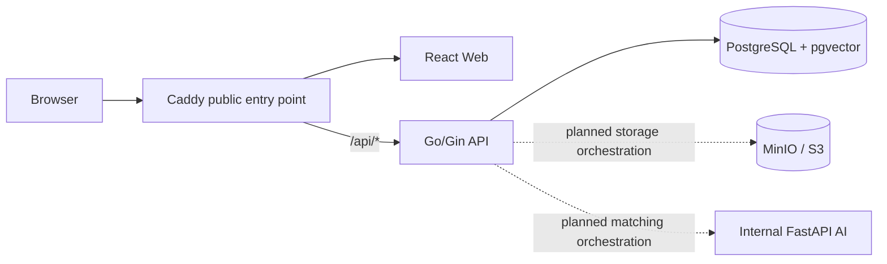

# LostLink

## Table of contents

- [LostLink](#lostlink)
  - [Table of contents](#table-of-contents)
  - [Overview](#overview)
  - [Current foundation scope](#current-foundation-scope)
  - [Architecture](#architecture)
  - [Project structure](#project-structure)
  - [Technology stack](#technology-stack)
    - [Web](#web)
    - [Go API](#go-api)
    - [Python AI service](#python-ai-service)
    - [Infrastructure](#infrastructure)
  - [Prerequisites](#prerequisites)
  - [Setup](#setup)
    - [1. Clone and select `develop`](#1-clone-and-select-develop)
    - [2. Create local environment configuration](#2-create-local-environment-configuration)
    - [3. Install web dependencies](#3-install-web-dependencies)
    - [4. Install Go dependencies](#4-install-go-dependencies)
    - [5. Install Python dependencies](#5-install-python-dependencies)
  - [Usage](#usage)
    - [Run the integrated environment](#run-the-integrated-environment)
    - [Run services separately](#run-services-separately)
    - [Make commands](#make-commands)
  - [Environment variables](#environment-variables)
  - [API and health checks](#api-and-health-checks)
    - [Public Go API through Caddy](#public-go-api-through-caddy)
    - [Direct service routes](#direct-service-routes)
  - [Database migrations](#database-migrations)
  - [Testing and quality](#testing-and-quality)
    - [Web](#web-1)
    - [Go API](#go-api-1)
    - [Python AI service](#python-ai-service-1)
    - [Full quality checks](#full-quality-checks)
  - [Development standards](#development-standards)
    - [Before changing files](#before-changing-files)
    - [Cross-cutting change checklist](#cross-cutting-change-checklist)
  - [AI-agent workflow](#ai-agent-workflow)
  - [Git workflow](#git-workflow)
  - [Security and privacy](#security-and-privacy)
  - [Known limitations](#known-limitations)
  - [Roadmap](#roadmap)
  - [FAQ](#faq)
    - [Why can AI similarity not approve a claim?](#why-can-ai-similarity-not-approve-a-claim)
    - [Why can the browser not call the AI service directly?](#why-can-the-browser-not-call-the-ai-service-directly)
    - [Why are PostgreSQL, MinIO, and Python not published locally?](#why-are-postgresql-minio-and-python-not-published-locally)
    - [Why are JWT variables present when authentication is unavailable?](#why-are-jwt-variables-present-when-authentication-is-unavailable)
    - [Why is the AI service OpenAPI schema disabled?](#why-is-the-ai-service-openapi-schema-disabled)
    - [Should I edit the existing migration?](#should-i-edit-the-existing-migration)
  - [AI and ownership boundary](#ai-and-ownership-boundary)

## Overview

LostLink is a privacy-conscious university Lost & Found platform designed around explicit reporting, matching, claiming, ownership verification, staff review, tracking, pickup, return, and closure stages.

The repository is a monorepo containing a React web client, a modular Go API, an internal Python AI service, PostgreSQL with pgvector, and S3-compatible object storage. The Go API is the only public application backend. The browser must not connect directly to PostgreSQL, storage credentials, or the AI service.

This repository currently provides a runnable foundation. Product workflows and authentication remain planned rather than implemented.

## Current foundation scope

Implemented:

- React application shell with a project-foundation landing page
- Shared React Query provider, React Router setup, and typed HTTP client foundation
- Go API process health endpoint and Scalar API Reference
- Go configuration, PostgreSQL connection, structured logging, and graceful shutdown foundations
- Internal FastAPI process health endpoint with public OpenAPI pages disabled
- Initial reversible migration that enables the PostgreSQL `vector` extension
- Dockerfiles, Docker Compose, Caddy routing, health checks, private backend networking, and persistent development volumes
- Web, Go, and Python unit tests plus a Playwright bootstrap smoke test
- GitHub Actions quality gates, pull-request policy checks, Dependabot, and CodeQL scanning
- Repository-wide agent guidance, scoped roles, and project-specific skills

Not implemented yet:

- Authentication, JWT sessions, or role-based access control
- Lost and found report creation or search
- Image upload and private object access workflows
- Embedding generation, pgvector candidate retrieval, multimodal ranking, or evaluation
- Claims, ownership verification, staff review, tracking, notifications, pickup, return, or closure
- Production deployment, backups, monitoring, or incident-response automation

## Architecture



The Go API is a modular monolith and the public trust boundary. The Python service owns bounded embedding and ranking computation only; it does not authorize users, control application workflow, or decide ownership.

| Component | Responsibility | Prohibited responsibility |
| --- | --- | --- |
| React Web | Presentation, interaction, and public Go API consumption | Direct database, storage-credential, or AI-service access |
| Go API | Public REST API, validation, authorization, workflow, persistence, storage, and AI orchestration | Delegating ownership decisions to similarity output |
| Python AI | Embedding, scoring, ranking, explanations, and offline evaluation | User authorization, claim approval, or primary database ownership |
| PostgreSQL | Application metadata, workflow state, audit metadata, and vector references | Base64 image objects or unbounded model artifacts |
| MinIO/S3 | Private image objects addressed by server-generated keys | Public-by-default object access |
| Caddy | Public routing to the web and Go API | Business logic or direct exposure of backend services |

See the [system overview](docs/architecture/system-overview.md), [system flow](docs/architecture/system-flow.md), and [security boundaries](docs/architecture/security-boundaries.md).

## Project structure

```text
.
├── apps/
│   ├── web/                         # React 19 and TypeScript web client
│   │   ├── src/
│   │   │   ├── api/                 # Typed HTTP client foundation
│   │   │   ├── features/            # Feature-owned modules and placeholders
│   │   │   ├── lib/                 # Shared client utilities
│   │   │   ├── pages/               # Route-level screens
│   │   │   └── routes/              # React Router configuration
│   │   └── tests/                   # Vitest and Playwright tests
│   ├── api/
│   │   ├── cmd/api/                 # Go API entry point
│   │   ├── docs/                    # Embedded OpenAPI 3 contract
│   │   └── internal/                # Modular application packages
│   └── ai/
│       ├── app/                      # Internal FastAPI application
│       └── tests/                    # Pytest suite
├── database/
│   ├── migrations/                  # Paired golang-migrate SQL files
│   ├── queries/                     # Future sqlc-compatible queries
│   ├── schema/                      # Schema notes and future snapshots
│   └── seeds/                       # Synthetic development seed guidance
├── deployments/
│   ├── docker/                      # Dockerfiles, Nginx, and Caddy config
│   └── production/                  # Production deployment guidance
├── docs/                            # Architecture, API, AI, database, and workflow docs
├── tests/                           # Cross-service integration and E2E guidance
├── .agents/skills/                  # LostLink-specific agent skills
├── .codex/agents/                   # Project agent role definitions
├── .github/                         # CI and collaboration configuration
├── docker-compose.yml
├── Makefile
└── README.md
```

## Technology stack

### Web

- React 19 and TypeScript
- Vite 7 and Tailwind CSS 4
- React Router and TanStack Query
- React Hook Form and Zod
- Lucide React
- Vitest, Testing Library, and Playwright

### Go API

- Go 1.25
- Gin
- pgx/v5 and pgxpool
- `log/slog`
- Scalar API Reference
- Standard `net/http/httptest`

### Python AI service

- Python 3.12+
- FastAPI and Uvicorn
- Pydantic
- Pytest and Ruff
- Optional ML group for NumPy, Pillow, scikit-learn, Sentence Transformers, PyTorch, and Transformers

### Infrastructure

- PostgreSQL 17 with pgvector 0.8.1
- MinIO/S3-compatible object storage
- Docker and Docker Compose
- Caddy and unprivileged Nginx
- GitHub Actions and CodeQL

## Prerequisites

- Node.js 22.12+ and npm 10+
- Go 1.25+
- Python 3.12+
- Docker with Compose v2 for the integrated environment
- GNU Make is optional

Check installed tools:

```bash
node --version
npm --version
go version
python --version
docker --version
docker compose version
```

## Setup

### 1. Clone and select `develop`

```bash
git clone https://github.com/err0r4o4-dev/lostlink.git
cd lostlink
git switch develop
```

### 2. Create local environment configuration

Linux/macOS:

```bash
cp .env.example .env
```

PowerShell:

```powershell
Copy-Item .env.example .env
```

`.env` is ignored by Git. Replace every placeholder before using a shared or deployed environment.

### 3. Install web dependencies

```bash
cd apps/web
npm ci
cd ../..
```

### 4. Install Go dependencies

```bash
cd apps/api
go mod download
cd ../..
```

### 5. Install Python dependencies

Linux/macOS:

```bash
cd apps/ai
python -m venv .venv
source .venv/bin/activate
python -m pip install -e ".[dev]"
cd ../..
```

PowerShell:

```powershell
cd apps/ai
python -m venv .venv
.venv\Scripts\Activate.ps1
python -m pip install -e ".[dev]"
cd ../..
```

Local dependency installation is optional when only using Docker Compose.

## Usage

### Run the integrated environment

```bash
docker compose up --build
```

Open <http://localhost:8088>. The same command starts all application services in development mode:

- Changes under `apps/web` are applied through Vite hot module replacement.
- Changes under `apps/api` rebuild and restart the Go process with Air.
- Changes under `apps/ai` restart Uvicorn automatically.

The source directories are bind-mounted, with polling enabled for reliable file detection through Docker Desktop. Dependency manifests, Dockerfiles, Compose, Caddy, and migration changes still require rebuilding or restarting the affected service.

Stop the stack safely:

```bash
docker compose down
```

PostgreSQL and MinIO data remain in named development volumes. Add `--volumes` only when intentionally removing that local data.

### Run services separately

Terminal 1 — web:

```bash
cd apps/web
npm run dev
```

Terminal 2 — Go API:

```bash
cd apps/api
go run ./cmd/api
```

Terminal 3 — Python AI service:

```bash
cd apps/ai
python -m uvicorn app.main:app --host 127.0.0.1 --port 8000 --reload
```

The Vite development server listens on <http://localhost:5173>. The standalone Go API listens on <http://localhost:8080>, and the standalone AI service listens on <http://localhost:8000>. The web client expects API requests under same-origin `/api`, so use the integrated Caddy environment when testing browser-to-API routing.

### Make commands

```bash
make web-check
make api-check
make ai-check
make compose-config
make check
```

Equivalent direct commands for Windows environments without GNU Make are listed in [CONTRIBUTING.md](CONTRIBUTING.md).

## Environment variables

The authoritative local template is [`.env.example`](.env.example).

| Variable or group | Purpose | Current status |
| --- | --- | --- |
| `APP_ENV` | Go API runtime environment | Used; defaults to `development` |
| `PUBLIC_PORT` | Caddy host port | Used; defaults to `8088` |
| `WEB_ORIGIN` | Intended browser origin | Reserved for future origin policy |
| `API_PORT` | Go API listen port | Used by direct API startup; Compose sets `8080` |
| `AI_PORT` | Intended AI-service port | Template value; Compose currently sets `8000` |
| `POSTGRES_DB`, `POSTGRES_USER`, `POSTGRES_PASSWORD` | PostgreSQL bootstrap configuration | Used by Compose |
| `DATABASE_URL` | Go and migration PostgreSQL connection | Used by Compose and the Go API |
| `MINIO_ROOT_USER`, `MINIO_ROOT_PASSWORD` | Local MinIO administrator credentials | Used by Compose |
| `STORAGE_ENDPOINT`, `STORAGE_BUCKET` | Future Go storage target | Wired into Compose; product storage is not implemented |
| `STORAGE_ACCESS_KEY`, `STORAGE_SECRET_KEY`, `STORAGE_USE_SSL` | Future Go storage access | Wired into Compose; product storage is not implemented |
| `JWT_ISSUER`, `JWT_AUDIENCE`, `JWT_ACCESS_TTL`, `JWT_REFRESH_TTL`, `JWT_SIGNING_KEY` | Reserved authentication contract | Authentication is not implemented |

Never commit `.env`, real credentials, tokens, keys, or production connection strings.

## API and health checks

### Public Go API through Caddy

| Method and URL | Purpose |
| --- | --- |
| `GET http://localhost:8088/api/health` | API process liveness |
| `GET http://localhost:8088/docs` | Public Scalar API Reference |
| `GET http://localhost:8088/docs/swagger.yaml` | Canonical OpenAPI 3.1 document |
| `GET http://localhost:8088/api/swagger/index.html` | Legacy URL; redirects to `/docs` |

### Direct service routes

| Service | Method and URL | Purpose |
| --- | --- | --- |
| Go API | `GET http://localhost:8080/health` | Process liveness when run directly |
| Go API | `GET http://localhost:8080/docs` | Scalar API Reference when run directly |
| Go API | `GET http://localhost:8080/docs/swagger.yaml` | OpenAPI document when run directly |
| Python AI | `GET http://localhost:8000/health` | Internal process liveness when run directly |

Examples:

```bash
curl http://localhost:8088/api/health
curl -i http://localhost:8088/docs
curl -i http://localhost:8088/docs/swagger.yaml
```

The canonical public contract is [`apps/api/docs/swagger.yaml`](apps/api/docs/swagger.yaml). It follows an OpenAPI 3.1 `info` → `servers` → `tags` → `paths` → `components` structure and is embedded into the Go binary so the file and Scalar page cannot drift. Scalar's browser assets are loaded from the pinned `@scalar/api-reference@1.63.0` CDN package, so the documentation UI requires internet access while the YAML route remains local. The AI service is internal in Docker Compose, and its OpenAPI JSON, documentation UI, and ReDoc routes are deliberately disabled. Public product APIs will use REST/JSON under `/v1`; no product routes exist in the current bootstrap.

## Database migrations

The `migrate` Compose service automatically applies pending up migrations before the Go API starts:

```bash
docker compose run --rm migrate
```

The current `000001_enable_vector` migration enables only the PostgreSQL `vector` extension. It does not create product tables. Every future schema change must add a new sequential `.up.sql` and `.down.sql` pair and be tested in both directions on a disposable database.

Never edit an applied migration or run a destructive rollback against shared data without explicit approval, a verified target, a backup, and a rollback plan. See [database conventions](docs/database/database-conventions.md).

## Testing and quality

### Web

```bash
cd apps/web
npm run lint
npm run typecheck
npm test -- --run
npm run build
npm run test:e2e -- --project=chromium
```

### Go API

```bash
cd apps/api
gofmt -w cmd internal docs
go vet ./...
go test ./...
go build -o .cache/lostlink-api ./cmd/api
```

### Python AI service

```bash
cd apps/ai
python -m pip install -e ".[dev]"
python -m ruff check .
python -m pytest
python -c "from app.main import app; assert app.title == 'LostLink Internal AI'"
```

### Full quality checks

```bash
make check
```

GitHub Actions also runs repository auditing, service quality gates, a browser smoke test, Compose validation, pull-request policy checks, and CodeQL. Never claim that a check passed unless it completed successfully.

## Development standards

### Before changing files

1. Start from a scoped task using the [task template](docs/workflow/TASK_TEMPLATE.md). Declare the owner, feature, sub-scope, goal, acceptance criteria, allowed writes, read-only paths, forbidden paths, dependencies, required checks, and explicit exclusions.
2. Inspect the applicable `AGENTS.md`, current Git status, affected code, contracts, configuration, and tests before editing. A nearer `AGENTS.md` may add stricter rules.
3. Define observable pass/fail criteria and select only the roles and skills needed for the assigned scope.
4. Make the smallest complete change. Preserve unrelated working-tree changes and do not combine cleanup or the next task with the current work.
5. Run the narrow affected checks while iterating, then all checks required by the change type. Report only checks that actually completed and keep host/tool limitations separate from repository failures.
6. Keep one task or frontend sub-scope per branch and pull request. Human review is required; agents do not stage, commit, push, create branches, open or merge pull requests unless explicitly asked.

The current repository is a foundation, not authorization to implement planned product behavior. Authentication, reports, matching, claims, verification, tracking, notifications, and administration require separately assigned scopes.

### Cross-cutting change checklist

Some changes are intentionally coupled across the repository. Use this map before deciding that a change is local:

| Change | Required accompanying work |
| --- | --- |
| Public Go route or DTO | Update Swagger/OpenAPI, API documentation, producers, consumers, authorization review, and contract/HTTP tests in the same coordinated scope. |
| Database schema or query | Add a new sequential paired up/down migration, keep SQL parameterized and sqlc-compatible, update repositories/docs, and exercise migration directions on disposable PostgreSQL when practical. |
| Authentication, RBAC, claims, uploads, or other sensitive data | Keep policy and workflow enforcement in Go; review least privilege, privacy, logging, retention/deletion, generic errors, and audit behavior; add security review and negative-path tests. |
| Image handling | Validate content, size, and count; use server-generated object keys and private S3-compatible storage; expose objects only through authorized short-lived access. Never store Base64 image blobs in PostgreSQL. |
| AI matching or model behavior | Keep Go orchestration separate from Python computation; version evaluation evidence, datasets, metrics, thresholds, and regression results. Similarity may rank candidates but must never approve ownership. |
| Frontend feature | Separate UI/presentation ownership from API/state/form integration ownership, coordinate shared contracts, and test loading, error, authorization, accessibility, and responsive states as applicable. |
| Environment, Docker, routing, or deployment | Synchronize `.env.example`, Compose/Docker/Caddy configuration, health checks, documentation, persistence, exposure, and shutdown behavior; validate the rendered Compose configuration. |

- Keep the Go API as the only public backend and preserve service ownership boundaries.
- Use explicit request and response DTOs; never serialize persistence or AI-internal models directly.
- Keep public APIs under `/v1`, except operational endpoints such as `/health`.
- Use feature-oriented React modules and keep frontend route guards as UX only.
- Keep SQL parameterized and sqlc-compatible, with transactions at service boundaries.
- Store private images in S3-compatible object storage, not as Base64 database blobs.
- Treat AI output as fallible and keep similarity separate from ownership verification.
- Add proportionate tests and synchronize contracts, Swagger, migrations, environment examples, and documentation.
- Preserve unrelated worktree changes and avoid opportunistic refactoring.

Repository-wide contribution rules are defined in [AGENTS.md](AGENTS.md), [CONTRIBUTING.md](CONTRIBUTING.md), and the [Definition of Done](docs/workflow/definition-of-done.md).

## AI-agent workflow

Repository roles live in `.codex/agents`, and project-specific skills live in `.agents/skills`. Agents are optional specialists selected according to the task scope; they do not replace human review.

Each task must declare its owner, feature, sub-scope, goal, allowed writes, read-only paths, forbidden paths, dependencies, required checks, and explicit exclusions. Review agents report findings and do not silently become implementers.

See the [agent workflow](docs/agents/agent-workflow.md), [task template](docs/workflow/TASK_TEMPLATE.md), and [team workflow](docs/workflow/team-workflow.md).

## Git workflow

```text
main
└── develop
    └── feature/<task-name-or-id>
```

Rules:

1. Branch from the latest `develop`.
2. Keep one task or sub-scope per branch and pull request.
3. Open feature pull requests into `develop`.
4. Promote `develop` to `main` only through a reviewed release pull request.
5. Use Conventional Commit-style pull-request titles.
6. Require passing checks and human approval.
7. Never force-push shared branches or push directly to `main`.

Owner-specific branch naming and frontend sub-scope rules are documented in the [Git workflow](docs/workflow/git-workflow.md).

## Security and privacy

- Deny access by default and enforce authentication and authorization in Go.
- Keep PostgreSQL, MinIO, migrations, and the AI service off the public network.
- Never expose another user's private report data or restricted verification evidence.
- Validate upload content, size, and count before storage; generate object keys server-side.
- Use private buckets and authorized short-lived object access when uploads are implemented.
- Never embed ownership answers, receipts, private serial details, contact data, or staff notes.
- Never log passwords, hashes, tokens, authorization headers, ownership answers, or claim evidence.
- Keep secrets, personal data, real university data, image uploads, model weights, and generated caches out of Git.

Report suspected vulnerabilities privately according to [SECURITY.md](SECURITY.md). This repository does not claim legal, privacy, security, accessibility, or AI-fairness compliance without formal evidence.

## Known limitations

- The application currently exposes only a foundation landing page and health/documentation routes.
- Authentication, RBAC, reports, matches, claims, verification, tracking, notifications, and administration are not implemented.
- PostgreSQL contains only the pgvector extension migration; product schemas and queries remain pending.
- MinIO is present in Compose, but upload, bucket provisioning, signed URL, retention, and deletion workflows are not implemented.
- The AI service exposes only internal health and does not load models or generate similarity results.
- No matching evaluation dataset, metrics baseline, thresholds, or production model artifacts exist yet.
- Live reload covers application source files; infrastructure, dependency, and migration changes still require an explicit rebuild or restart.
- Production deployment, TLS policy, backup/restore, monitoring, alerting, and incident response remain unconfigured.

## Roadmap

1. Authentication and role-based authorization
2. Lost report workflow
3. Found report workflow
4. AI-assisted matching and evaluation
5. Claim and ownership verification
6. Tracking and notifications
7. Staff and administration workflows
8. Release integration, deployment, and operational readiness

The detailed owner and task-ID mapping is maintained in the [project roadmap](docs/workflow/roadmap.md).

## FAQ

### Why can AI similarity not approve a claim?

Similarity answers whether two reports might describe the same item. Ownership verification uses separate private evidence, authorization rules, audit records, and staff review. A high score cannot transition a claim to approved.

### Why can the browser not call the AI service directly?

The Go API owns authentication, authorization, validation, workflow state, timeouts, and public DTO shaping. Direct browser-to-AI requests would bypass those controls.

### Why are PostgreSQL, MinIO, and Python not published locally?

They are backend dependencies and do not need public host access. The default Compose topology publishes only Caddy on `127.0.0.1` and keeps backend traffic on private Docker networks.

### Why are JWT variables present when authentication is unavailable?

They reserve the intended future configuration contract. Their presence does not mean login, refresh, logout, or RBAC behavior has been implemented.

### Why is the AI service OpenAPI schema disabled?

It is an internal computation service, not a public application API. Public Swagger documents only Go-owned endpoints.

### Should I edit the existing migration?

No. Add a new sequential paired up/down migration. Applied migration history must remain immutable.

## AI and ownership boundary

LostLink's AI capability is a discovery aid, not an ownership authority. Item similarity and ownership verification remain separate modules, policies, DTOs, permissions, and audit trails.
